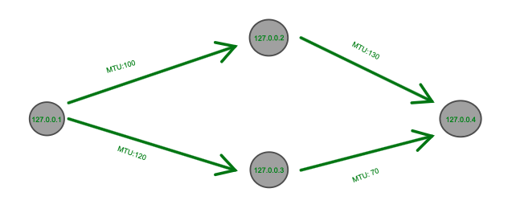

### Tarea 3
Matías Godoy Concha

## Implementación
En la tarea se muestra la implementación de un fragmentizador de mensajes IP teniendo las siguientes consideraciones:
1. Si es para usted, imprimir el mensaje completo (unir los fragmentos)
2. Si no es para usted y existe un enlace donde quepa el mensaje completo enviarlo por allá, sino distribuir en los distintos enlaces dependiendo del MTU de cada uno
3. Si no es para usted y no existe un enlace de destino, botar el datagrama

Además tomé algunas consideraciones:
- Si llega un mensaje y durante 10 segundos no llega ninguno más, se borra tal mensaje.
- Si me llega un mensaje y uno de mis enlaces tiene la ip de destino se envía únicamente a este enlace, ya sea completo si es que cabe, y si es que no cabe, lo fragmento y **se envía fragmentado a esa única IP**

## Testing
Para probar el siguiente programa se sugiere probar de la siguiente forma:

En distintas terminales ejecutar los siguientes códigos:

```
python3 fragmentizador.py 127.0.0.1:5000 127.0.0.2:5001:100 127.0.0.3:5002:120
```
```
python3 fragmentizador.py 127.0.0.2:5001 127.0.0.4:5003:130
```
```
python3 fragmentizador.py 127.0.0.3:5002 127.0.0.4:5003:70
```

```
python3 fragmentizador.py 127.0.0.4:5003
```

Esto lo que hará será red de uniones de "routers" de la siguiente forma:


Luego, se puede ejecutar el siguiente código en una nueva terminal:

```
python3 prueba.py
```
Código que enviará un datagrama al primer router de la red.

Como consideración, el archibo prueba.py asume que el datagrama cabrá en el buffer de recepción del primer "Router" creado.
